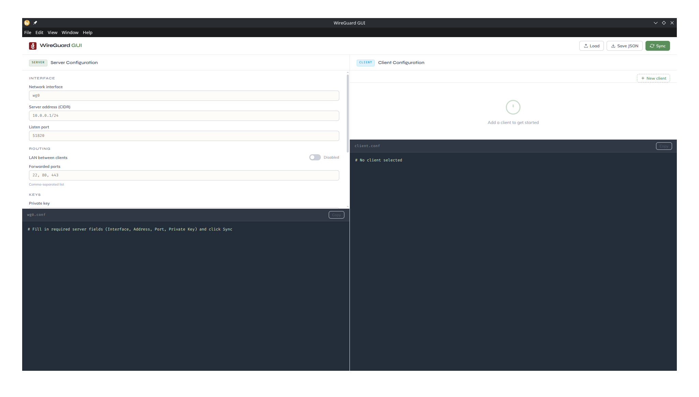
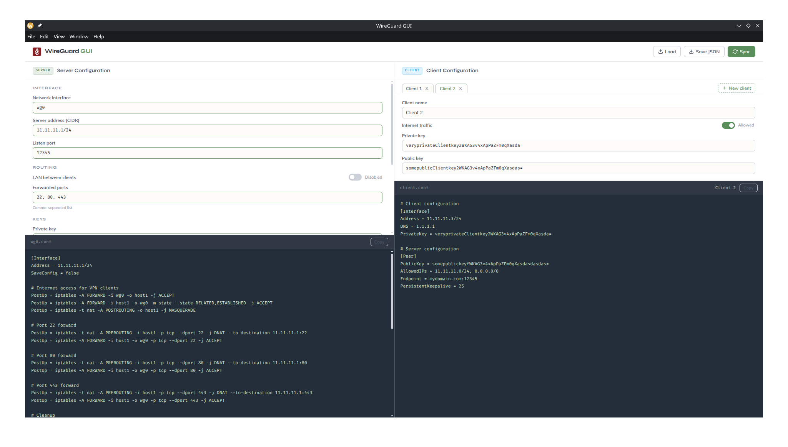

# WireGuard GUI

A desktop application for generating WireGuard server and client configuration files through a graphical interface, built with [Electron](https://www.electronjs.org/).

Instead of hand-editing `.conf` files, you fill in a form and get ready-to-use WireGuard configs, including all the `iptables` rules, instantly.

## Getting Started

### Prerequisites

- [Node.js](https://nodejs.org/) v18 or later
- npm

### Install and run

```bash
npm install
npm start
```

## Usage

1. Fill in the **Server** panel on the left -> interface, address, port, keys, and any optional settings
2. Add one or more clients with the **New client** button on the right
3. Fill in each client's keys and toggle internet access as needed
4. Click **Sync** -> both config previews update immediately
5. Use the **Copy** button on either panel to copy the config text to your clipboard
6. Use **Save JSON** in the header to persist the full setup, and **Load** to restore it later

### Field reference

**Server**

| Field                 | Description                                            |
| --------------------- | ------------------------------------------------------ |
| Network interface     | WireGuard interface name, e.g. `wg0`                   |
| Server address        | Internal VPN address in CIDR, e.g. `10.0.0.1/24`       |
| Listen port           | UDP port WireGuard listens on, e.g. `51820`            |
| LAN between clients   | Allows peers to reach each other directly              |
| Forwarded ports       | Comma-separated list of ports to DNAT into the VPN     |
| Private / Public key  | WireGuard base64 key pair for the server               |
| Public address        | Hostname or IP clients use to reach the server         |
| Running in Docker     | Uses the Docker host interface in iptables rules       |
| Docker host interface | The physical interface on the Docker host, e.g. `eth0` |

**Client** (per peer)

| Field                | Description                                               |
| -------------------- | --------------------------------------------------------- |
| Client name          | Label used in tabs and config comments                    |
| Internet traffic     | When on, routes all traffic through the VPN (`0.0.0.0/0`) |
| Private / Public key | WireGuard base64 key pair for this client                 |

### Key generation

WireGuard keys can be generated on the server with:

```bash
wg genkey | tee privatekey | wg pubkey > publickey
```

---

## Screenshots




